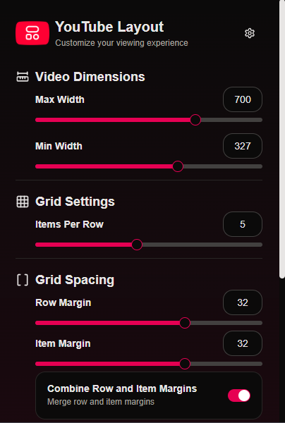
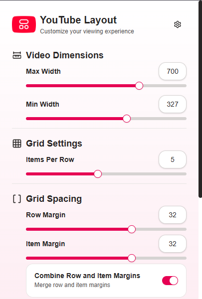
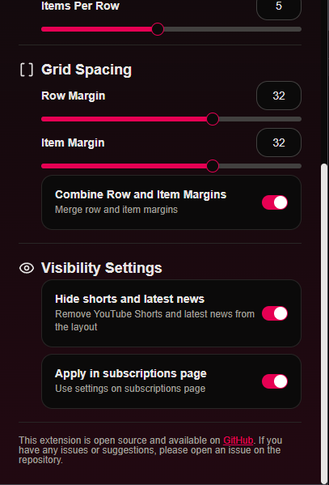
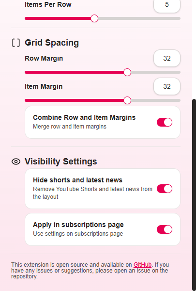

<p align="center">
  
</p>

# YouTube Layout Customizer

A Chrome extension that allows you to personalize the YouTube layout for a cleaner, more comfortable, and distraction-free viewing experience.

## Features

- **Dark Mode:** Sleek, eye-friendly interface.
- **Thumbnail Dimensions:**
  - Set custom maximum and minimum video widths.
- **Grid Settings:**
  - Choose how many videos appear per row.
- **Custom Spacing:**
  - Adjust row and item margins.
  - Option to merge row and item margins.
- **Hide Distractions:**
  - Remove YouTube Shorts and latest news from the homepage.
- **Apply to Subscriptions Page:**
  - Use the same layout settings on the Subscriptions feed.

## Screenshots

### Main settings

|                            Dark Theme                             |                             Light Theme                             |
| :---------------------------------------------------------------: | :-----------------------------------------------------------------: |
|  |  |

### Visibility settings

|                            Dark Theme                             |                             Light Theme                             |
| :---------------------------------------------------------------: | :-----------------------------------------------------------------: |
|  |  |

## Installation

1. Download or clone this repository.
2. Navigate to the repository folder using your terminal:

```sh
cd yt-layout-customizer
```

3. Install the dependencies (if you don't have `pnpm`, install it first):

```sh
pnpm install
```

4. Run the build command:

```sh
pnpm build
```

5. Open Chrome and go to `chrome://extensions`.
6. Enable **Developer mode** (top right).
7. Click **"Load unpacked"** and select the _dist_ folder.

## Contributing

This is an open-source project. Feel free to open an issue or submit a pull request with improvements or bug fixes!

## License

[MIT License](LICENSE)
